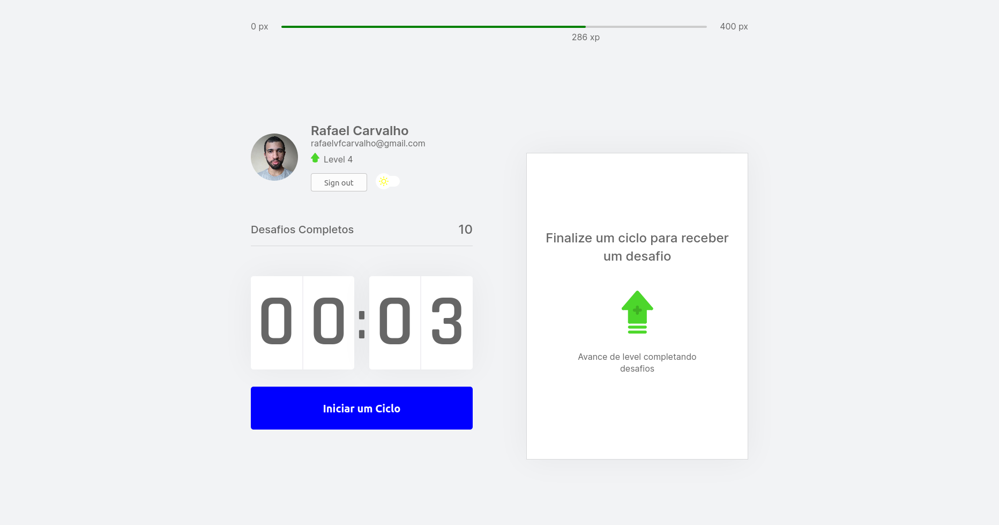
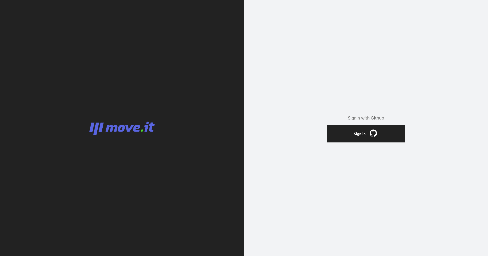

# Move.it
With Move.it you can be more productive and healthy. Based on Pomodoro technique, you have 25min to work on your projects and after that you'll be challenged with body and eye exercices that helps you to keep your good health.

It was developed in the Next Level Week #4 from Rocketseat.

## Tecnologies
- Nextjs/React
- Typescript
- Sass

## Screenshots

